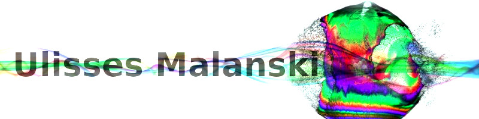

# Hi I'm Ulisses Malanski  🇧🇷 🇵🇹 🇬🇧 🇺🇸 🇪🇸 🇫🇷 

  </b>
  
### About me:

&ensp;&ensp;&ensp;Front-end programmer and developer, Bachelor's degree in drawing (EMBAP) and Technologist in product and graphic design (ENSITEC). Professional art teacher and tattoo artist. Spare time musician, guitarist, drums and synthesizer programming.

&ensp;&ensp;&ensp;Always involved with technology and art, I take these resources to professional life in forms of expression. I have ease to work with groups, good relationship with people, responsibility and spirit of leadership. I have a passion for science and new experiences in communication, education and photography.

### Main skills:

&nbsp;
&nbsp;
&nbsp;
&nbsp;
&nbsp;

### Tools:

&nbsp;
&nbsp;
&nbsp;
&nbsp;
&nbsp;
&nbsp;
&nbsp;

### Other Knowledge:

&nbsp;
&nbsp;
&nbsp;
&nbsp;
&nbsp;
&nbsp;

### Studying in this moment:
&nbsp;
&nbsp;
  
<a href="https://web.dio.me/" align="center">

 
 
### Areas of Interest:

&nbsp;
&nbsp;
  

### GitHub Analytics:

   
 
 

### Links to Other Projects by Ulisses Malanski   
 
- <a href="https://malanski.github.io/cron/" title="Cronometer" target="_blank">Cron</a>  
- <a href="https://poke-store-next.vercel.app//" title="Nextjs Ecommerce Pokemon Store" target="_blank">Poké-Store Next Js</a>
- <a href="https://malanski.github.io/pokestore-react/" title="Reactjs Ecommerce Pokemon Store" target="_blank">PokéStore React Js</a>  
- <a href="https://malanski.github.io/GessingColorGame/" title="Color Game JavaScript CSS HTML" target="_blank">Gessing Color Game</a>
- <a href="https://malanski.github.io/projeto-react-app2/" title="Artistic Portfolium" target="_blank">Portfolium React App</a>
- <a href="https://malanski.github.io/CalculatorX/" title="JavaScript study Calculator">Calculator</a>  
- <a href="https://malanski.github.io/pokeLoja2/" title="My Firts Vanilla Ecommerce project">Vanilla Ecommerce Poke Card Game Styled</a>  
- <a href="https://malanski.github.io/awari-ulisses-dev/" title="Web Development Courses Activity">Web Development Courses Activities</a>  
- <a href="https://malanski.github.io/MyResume/" title="A short personal Resume">My Resume</a>  

### Ulisses Malanski on social media:

 

 
  Visitor count 
  

 
